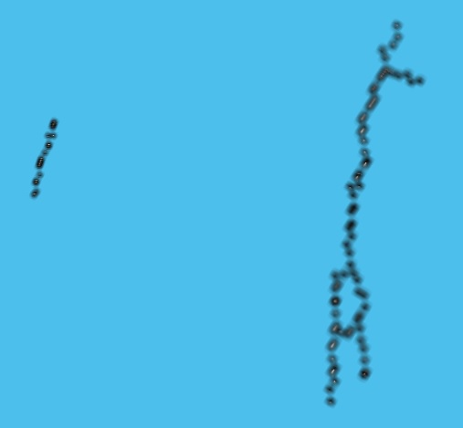
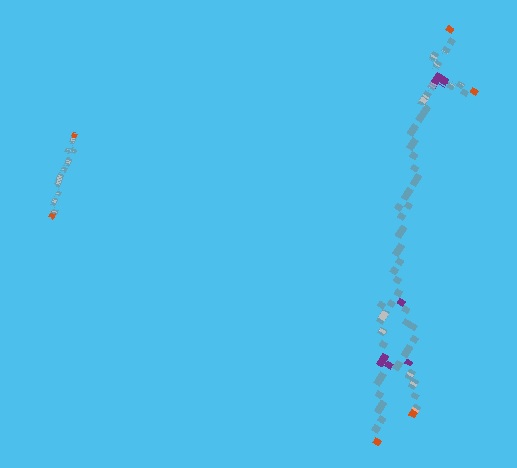

## Terminal points and branch points detection

This code detects terminal points and branch points in a 3D binary image. 

#### Definition
Terminal point: A voxel that has only one neighbor.  
Branch point: A voxel that has at leaset three neighbors.
  

  

In the above picture, red voxels are terminal points and green one is a branch point.  

#### Detection strategy
For terminal point: 
* Take 3x3x3 neighbors around the voxel 
* Get summation of the neighbors' intensity along with the voxel's intensity
* If the summation is 2, then it is a terminal point

For branch point:  
* Take 3x3x3 neighbors around the voxel 
* Get summation of the neighbors' intensity along with the voxel's intensity
* If the summation is greater than 3, then it is a branch point
 
#### Screenshot
Original image:
  
Output: (reds are terminal points, purples are branch points)

